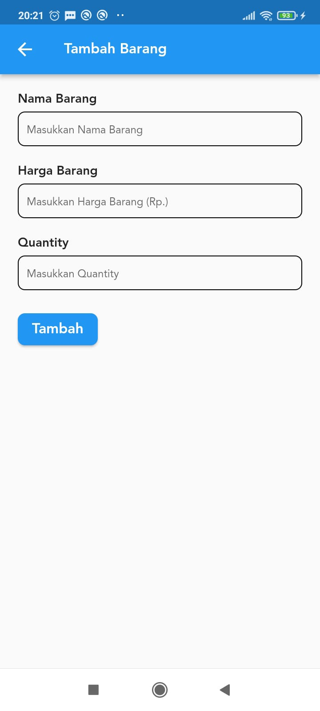
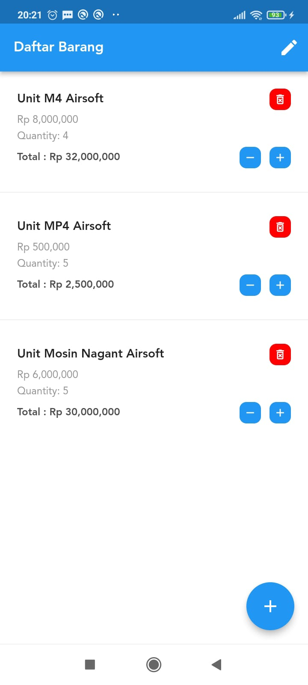

# Latihan CRUD Dengan Cubit

## Getting Started

Latihan Dasar update UI menggunakan Cubit (Bloc) dan Equitable ,memanfaatkan
teknik copyWith untuk update nilai pada State supaya menghasilkan
state yg berbeda dengan sebelumnya agar UI Widget terupdate oleh Bloc Builder

Aplikasi dibuat menggunakan Flutter versi 2.10.5

Selamat Mempelajari dan semoga bermanfaat :D

 
 
